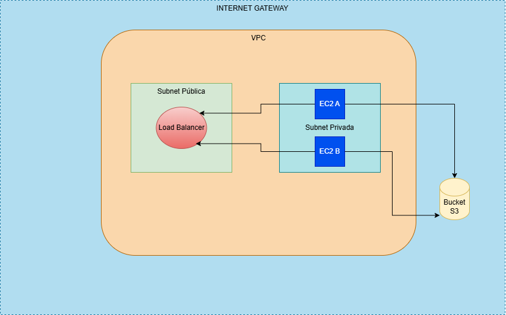

# Thumbnails as a Service (TaaS)



## Descrição
Desenvolvimento de um sistema de thumbnails como serviço (TaaS) usando Terraform na AWS. O projeto cria uma VPC, instâncias EC2 para processamento e um bucket S3 para armazenamento. Ele gera e serve thumbnails de imagens de amostra, proporcionando uma solução eficiente para aplicativos de mídia e streaming.

## Tecnologias Utilizadas
- AWS (VPC, EC2, S3)
- Terraform


## Estrutura do Projeto
- `infrastructure/`: Contém os arquivos de configuração do Terraform para criar a VPC e recursos associados.
- `scripts/`: Scripts para geração de thumbnails.
- `README.md`: Este arquivo.

## Como Executar o Projeto
1. Clone o repositório:
   ```bash
   git clone https://github.com/SEU_USUARIO/thumbnails-as-a-service.git
   cd thumbnails-as-a-service
